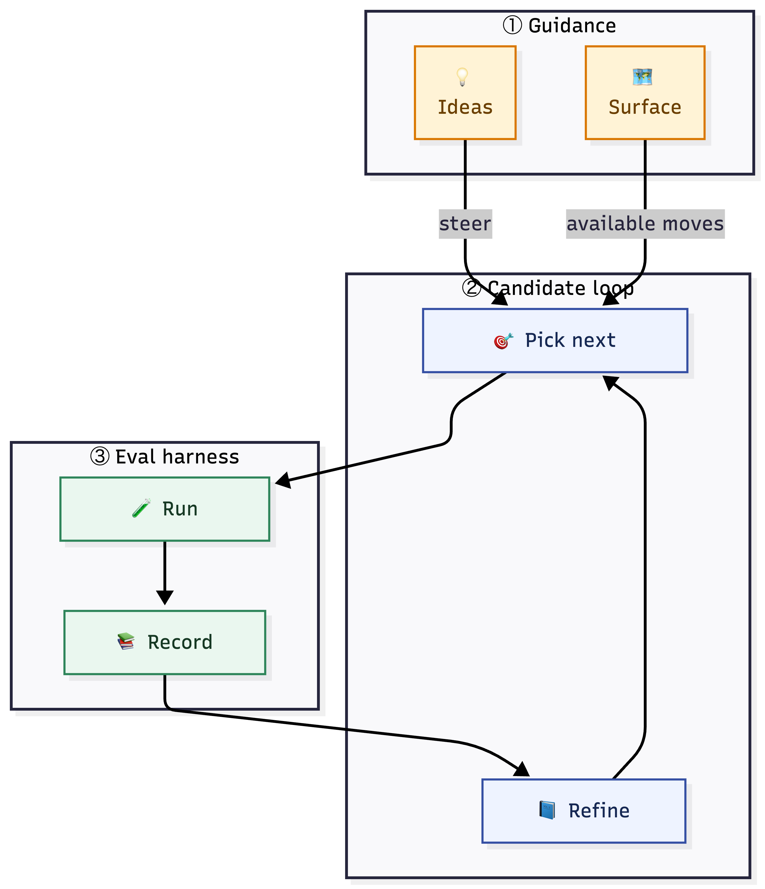

<div align="center">


# autoclanker

### Bayesian Harness over Agent Eval Loops

[](https://www.python.org/)
[](LICENSE)
[](autoclanker/py.typed)
[](#quickstart)
[](docs/INTEGRATIONS.md)

**[Quickstart](#quickstart)** ·
**[Demo Paths](#demo-paths)** ·
**[How It Works](#how-it-works)** ·
**[Session Flow](#session-flow)** ·
**[Run Artifacts](#run-artifacts)** ·
**[Live Exercises](#live-exercises)** ·
**[Documentation](#documentation)**

</div>

*Guide the search you already trust with typed, previewable Bayesian priors.*

`autoclanker` sits between an outer search or evolutionary loop and an eval
harness. It turns rough optimization ideas into typed, previewable priors that
can influence ranking, active querying, and commit decisions without replacing
the underlying loop.

## Why autoclanker

- Keep your existing eval harness instead of rebuilding around a new optimizer.
- Keep several candidate lanes explicit so an outer harness can explore them in parallel when practical.
- Add inspectable human & LLM beliefs instead of relying on prompt-only steering.
- Preview compiled priors before they affect a session.
- Fit an exact joint linear posterior over explicit main and screened pair features when that math is safe, then fall back automatically when it is not.
- Use real finite-pool Thompson-style sampling when the posterior is sampleable, with an optimistic deterministic fallback when it is not.
- Separate utility and feasibility so risky candidates stay visible but bounded.
- Persist surface snapshots, append-only eval observations, canonicalization summaries, and influence summaries to disk.
- Work with generic external adapters, plus built-in `autoresearch` and `cevolve` integrations.

## How It Works

<p align="center">
  
</p>

The core idea is simple: keep the outer loop you already trust, but make it
belief-aware in a way that is typed, previewable, resumable, and friendly to
explicit multi-lane exploration.

The loop itself is simpler than the full belief machinery:

```text
ideas / hints
     |
     v
pick next lanes: [A] [B] [A+B] ---> run evals ---> record results
      ^          (fixed eval snapshot)  (parallel)        |
      |                                                   |
      +---------- rank / refine / query <-----------------+
```

For a more detailed diagram, see [here](docs/assets/autoclanker_mermaid.png).

In practice, that means `suggest` can rank an explicit candidate pool instead of
one opaque prompt thread, an outer harness can evaluate the available lanes in
parallel when practical, and the session keeps a locked eval contract plus each
observed eval result on disk so the same comparison can be revisited later
without quietly drifting the benchmark surface.

When enough typed signal and usable explicit features are present, the objective
model is a small exact joint Bayesian linear posterior over explicit candidate
features: main effects, screened pair effects, and compact metadata like
active-gene count. When that feature set is empty, or when the exact solve or
its sampling path is numerically unsafe, `autoclanker` records the reason and
falls back to the earlier heuristic objective path instead of failing the
session.

Likewise, `constrained_thompson_sampling` is now a real sampled finite-pool
acquisition path over the explicit candidate frontier once there is observed
signal to sample against. Prior-only cold starts and numerically unsafe sampling
paths fall back to the deterministic optimistic scorer, and that backend choice
is reported in JSON artifacts.

The outer-layer adapter and session-boundary outer loop over
[Autoresearch](https://github.com/karpathy/autoresearch) here was inspired by
[cEvolve](https://github.com/jnormore/cevolve), which remains a first-party
integration target.

## What You Get

- A non-interactive `autoclanker` CLI.
- A typed belief schema with beginner and expert lanes.
- Deterministic and model-assisted canonicalization for rough ideas.
- Era-local objective and feasibility models with an exact explicit-feature
  posterior when safe, plus explicit fallback metadata when not.
- A filesystem-backed session store.
- Public examples for Bayes-first, `autoresearch`, and `cevolve` workflows.

## Plain-Language Vocabulary

The smallest useful mental model is:

- `optimization lever (gene)`: one explicit upstream knob the adapter exposes
- `setting (state)`: one concrete value of that lever
- `candidate lane` or `pathway`: one concrete combination being evaluated
- `frontier`: the explicit set of lanes under comparison
- `belief`: a typed claim about one lever, relation, risk, or preference
- `fit`: update the era-local model from eval observations
- `suggest`: rank the current frontier and ask what to test next
- `comparison query`: a concrete lane-vs-lane or family-vs-family question that
  would reduce uncertainty next

The important honesty boundary is that `autoclanker` learns over explicit
candidate features and typed relations, not hidden prompt state.

## Installation

From a source checkout:

```bash
uv sync --dev
```

Or use the repo front door:

```bash
./bin/dev setup
```

Or with pip:

```bash
python -m venv .venv
source .venv/bin/activate
pip install -e ".[dev]"
```

The installed CLI entry point is:

```bash
autoclanker --help
```

If `autoresearch` or `cevolve` are already installed on your machine, the
recommended first-party adapter shape is `mode: auto` plus either `python_module`
or `command`. A checkout-backed `repo_path` is still supported, but it is not the
only integration route.

If you do want checkout-backed optional upstreams for the shipped smoke exercises,
the quickest provisioning commands are:

```bash
./bin/dev deps upstreams
./bin/dev deps autoresearch
./bin/dev deps cevolve
```

Equivalent task surfaces are available through `mise` and `make`.

For local secrets or live-test overrides, copy
[`/.env.example`](.env.example) to `.env.local`. The repo ignores `.env`,
`.env.local`, and `.env.*.local`.

## Quickstart

Start with the parser-oriented beginner lane.

The smallest reusable input in the repo is:

```json
{
  "ideas": [
    "Compiled regex matching probably helps this parser on repeated log formats.",
    {
      "idea": "A wide capture window is likely to run out of memory on long traces.",
      "confidence": 3,
      "effect": "hurt",
      "risks": ["oom"]
    }
  ]
}
```

That is the exact shape from
[`examples/idea_inputs/minimal.json`](examples/idea_inputs/minimal.json).

Inspect the available optimization surface:

```bash
autoclanker adapter registry
autoclanker adapter surface
```

Preview that file directly:

```bash
autoclanker beliefs preview \
  --input examples/idea_inputs/minimal.json \
  --era-id era_log_parser_v1
```

Or try the same idea flow inline:

```bash
autoclanker beliefs preview \
  --era-id era_log_parser_v1 \
  --ideas-json '[
    "Compiled regex matching probably helps repeated incident formats.",
    "Keeping breadcrumbs beside each alarm probably pairs well with the context-pair plan."
  ]'
```

If you want the typed canonical beliefs back explicitly:

```bash
autoclanker beliefs canonicalize-ideas \
  --era-id era_log_parser_v1 \
  --ideas-json '[
    "Compiled regex matching probably helps repeated incident formats.",
    "Keeping breadcrumbs beside each alarm probably pairs well with the context-pair plan."
  ]'
```

If you prefer a reusable file, start from
[`examples/idea_inputs/minimal.json`](examples/idea_inputs/minimal.json) or
[`examples/idea_inputs/minimal.yaml`](examples/idea_inputs/minimal.yaml).

## Demo Paths

If you are deciding where to start, use these in order:

| Demo | Best for | Start with |
| --- | --- | --- |
| [`bayes_quickstart`](examples/live_exercises/bayes_quickstart/README.md) | clearest first demo; parser-based rough-ideas workflow | [`minimal.json`](examples/idea_inputs/minimal.json) or [`bayes_quickstart.json`](examples/idea_inputs/bayes_quickstart.json) |
| [`autoresearch_simple`](examples/live_exercises/autoresearch_simple/README.md) | real-upstream `autoresearch`; mostly additive landscape | [`autoresearch_simple.json`](examples/idea_inputs/autoresearch_simple.json) |
| [`cevolve_synergy`](examples/live_exercises/cevolve_synergy/README.md) | real-upstream `cevolve`; interaction-heavy landscape | [`cevolve_synergy.json`](examples/idea_inputs/cevolve_synergy.json) |
| [`bayes_complex`](examples/live_exercises/bayes_complex/README.md) | advanced priors, feasibility, and graph directives | [`docs/LIVE_EXERCISES.md`](docs/LIVE_EXERCISES.md) |

First commands for each path:

- `bayes_quickstart`: `autoclanker beliefs preview --input examples/idea_inputs/minimal.json --era-id era_log_parser_v1`
- `autoresearch_simple`: `./bin/dev test-upstream-live`
- `cevolve_synergy`: `./bin/dev test-upstream-live`
- `bayes_complex`: follow section `3.4` in [`docs/LIVE_EXERCISES.md`](docs/LIVE_EXERCISES.md)

The first row is the simplest product demo. The `autoresearch` and `cevolve`
rows are contrast exercises over different upstream-flavored workloads, not the
same parser app in three different modes.

If you are browsing the repo tree directly,
[`examples/README.md`](examples/README.md) separates the runnable demos from the
secondary toy examples.

## Session Flow

The intended flow is:

```text
rough ideas
→ preview or canonicalize
→ session init (store preview + locked eval contract)
→ apply previewed beliefs
→ run-eval or ingest eval results
→ fit
→ suggest against an explicit candidate pool or frontier
→ recommend-commit
```

The important additive behavior in this phase is:

- `fit` now records whether the objective backend was the exact joint linear
  posterior or the heuristic fallback, plus condition diagnostics and fit time;
- `suggest` records whether acquisition used real constrained Thompson sampling
  or the optimistic fallback path;
- `query.json` now prefers concrete candidate or family comparison prompts when
  uncertainty is localized enough to ask a clean lane-vs-lane question.

A minimal session kickoff looks like:

```bash
autoclanker session init \
  --session-id parser-demo \
  --era-id era_log_parser_v1 \
  --ideas-json '[
    "Compiled regex matching probably helps repeated incident formats.",
    "Keeping breadcrumbs beside each alarm probably pairs well with the context-pair plan."
  ]'
```

`session init` returns a `preview_digest`. Apply that digest before fitting or
suggesting so beliefs become active:

```bash
autoclanker session apply-beliefs \
  --session-id parser-demo \
  --preview-digest <digest-from-session-init>
```

If you want `autoclanker` itself to execute the evals under the locked contract,
use `run-eval` for one candidate or `run-frontier` for a multi-path frontier:

```bash
autoclanker session run-frontier \
  --session-id parser-demo \
  --frontier-input examples/frontiers/parser_frontier.json
```

Those hardened execution commands use the locked eval contract as the trust
boundary. They isolate the candidate workspace, and when the active eval policy
marks the benchmark as measurement-sensitive they also serialize the measured
phase behind a contract-scoped lease and record soft-stabilization metadata on
the eval result.

Once the session has observations, `fit`, `suggest`, `frontier-status`,
`review-bundle`, `recommend-commit`, and `render-report` keep a small
human-readable report bundle refreshed inside the session root. When you have
several candidate lanes to compare, `suggest` can rank them together from
`--candidates-input` while the underlying eval runs stay parallelizable in
whatever outer harness you already trust.

## Run Artifacts

The session root now keeps machine-readable Bayesian state, a reproducible
surface snapshot, append-only eval observations, and a compact report bundle:

```text
.autoclanker/<session_id>/
  session_manifest.yaml
  eval_contract.json
  beliefs.yaml
  compiled_preview.json
  compiled_priors.json
  observations.jsonl
  frontier_status.json
  posterior_summary.json
  belief_delta_summary.json
  query.json
  commit_decision.json
  proposal_ledger.json
  influence_summary.json
  eval_runs/
  RESULTS.md
  convergence.png
  candidate_rankings.png
  belief_graph_prior.png
  belief_graph_posterior.png
```

The key files are:

- `RESULTS.md`: current run summary with top candidates, belief-change and
  proposal sections, follow-up queries, and commit state
- `eval_contract.json`: locked benchmark tree, eval harness, adapter, and
  environment digests for the session, plus the effective measurement policy
- `observations.jsonl`: append-only eval results recorded for the session
- `frontier_status.json`: persisted family representatives, pending queries, and
  heuristic merge suggestions for the active frontier
- `belief_delta_summary.json`: machine-readable prior-vs-posterior change
  summary for strengthened or weakened features, promoted or dropped lanes, and
  remaining uncertainty worth highlighting downstream
- `proposal_ledger.json`: machine-readable per-era proposal state for the
  current best lane, alternatives, blockers, and recommendation linkage
- `eval_runs/`: per-candidate execution records written by `run-eval` and
  `run-frontier`, including contract echo and lease/stabilization metadata
- `convergence.png`: observed utility over time plus best-so-far progress
- `candidate_rankings.png`: current ranked candidates with acquisition scores
- `belief_graph_prior.png`: the prior interaction structure implied by active
  beliefs
- `belief_graph_posterior.png`: the posterior interaction structure learned from
  the current era

For wrappers or dashboards, you can derive one normalized review surface without
creating another persisted artifact:

```bash
autoclanker session review-bundle \
  --session-id parser-demo \
  --format json
```

That derived bundle summarizes the same session as Prior / Run / Posterior /
Proposal briefs plus lane, proposal, lineage, trust, evidence, and next-action
state. `RESULTS.md` renders the same review model for human readers.

Treat those charts as evidence views:

- prior graph: what the session believed before evidence
- posterior graph: what still looks plausible after evals
- candidate rankings: which lanes currently look strongest
- convergence: whether new evals are still changing the picture

You can refresh that bundle explicitly at any point:

```bash
autoclanker session render-report \
  --session-id parser-demo
```

## Model-Assisted Canonicalization

`autoclanker` can canonicalize rough ideas with a real model provider, but free
text still never updates the posterior directly. The provider must emit typed
beliefs or explicit metadata-only proposals.

With Anthropic configured:

```bash
autoclanker beliefs canonicalize-ideas \
  --era-id era_log_parser_v1 \
  --canonicalization-model anthropic \
  --ideas-json '[
    "Bias the search toward reusing the parse path for recurring incident families."
  ]'
```

## Advanced Beliefs

The beginner lane is intentionally small. When you need direct prior geometry or
explicit pair-screening rules, use the advanced skill in
[`skills/advanced-belief-author/SKILL.md`](skills/advanced-belief-author/SKILL.md).

That workflow is:

```text
rough ideas
→ inspect registry and surface
→ canonicalize
→ preview
→ escalate only the unresolved or high-impact beliefs
→ emit a compact advanced JSON belief batch
```

## Live Exercises

Recommended runnable demos:

- [`examples/live_exercises/bayes_quickstart`](examples/live_exercises/bayes_quickstart)
- [`examples/live_exercises/autoresearch_simple`](examples/live_exercises/autoresearch_simple)
- [`examples/live_exercises/cevolve_synergy`](examples/live_exercises/cevolve_synergy)
- [`examples/live_exercises/bayes_complex`](examples/live_exercises/bayes_complex)

Secondary toy examples:

- [`docs/toy_examples/README.md`](docs/toy_examples/README.md)
- [`docs/TOY_EXAMPLES.md`](docs/TOY_EXAMPLES.md)

Useful validation lanes:

- `./bin/dev check`: self-contained required gate
- `./bin/dev test-upstream-live`: real-upstream non-billed smoke lane
- `AUTOCLANKER_ENABLE_LLM_LIVE=1 ./bin/dev test-live`: billed real-model-provider lane

## Documentation

- [`docs/SPEC.md`](docs/SPEC.md): normative product contract
- [`docs/DESIGN.md`](docs/DESIGN.md): architecture and workflow decisions
- [`docs/INTEGRATIONS.md`](docs/INTEGRATIONS.md): adapter model and upstream behavior
- [`docs/BELIEF_INPUT_REFERENCE.md`](docs/BELIEF_INPUT_REFERENCE.md): belief fields, bounds, and beginner inputs
- [`docs/LIVE_EXERCISES.md`](docs/LIVE_EXERCISES.md): runnable demos and live lanes
- [`docs/BENCHMARKS.md`](docs/BENCHMARKS.md): deterministic comparison targets and report script
- [`docs/LOOP_DIAGRAM.md`](docs/LOOP_DIAGRAM.md): compact loop visual
- [`docs/TOY_EXAMPLES.md`](docs/TOY_EXAMPLES.md): secondary toy examples for code-level intuition
- [`docs/WHITEPAPER.md`](docs/WHITEPAPER.md): research framing and design rationale
- [`docs/COMPLIANCE_MATRIX.md`](docs/COMPLIANCE_MATRIX.md): machine-readable acceptance mirror

## Development

From a checkout:

```bash
./bin/dev setup
./bin/dev check
```

The main local quality commands are:

```bash
./bin/dev format
./bin/dev lint
./bin/dev typecheck
./bin/dev pylint
./bin/dev test
./bin/dev test-full
./bin/dev check
```

See [`.github/CONTRIBUTING.md`](.github/CONTRIBUTING.md), [`docs/STYLE.md`](docs/STYLE.md), and
[`docs/developer-environment.md`](docs/developer-environment.md) for contributor
guidance.

## License

Apache 2.0. See [`LICENSE`](LICENSE).
