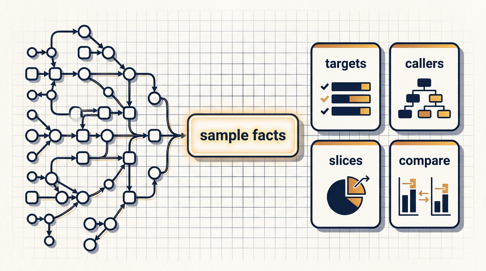
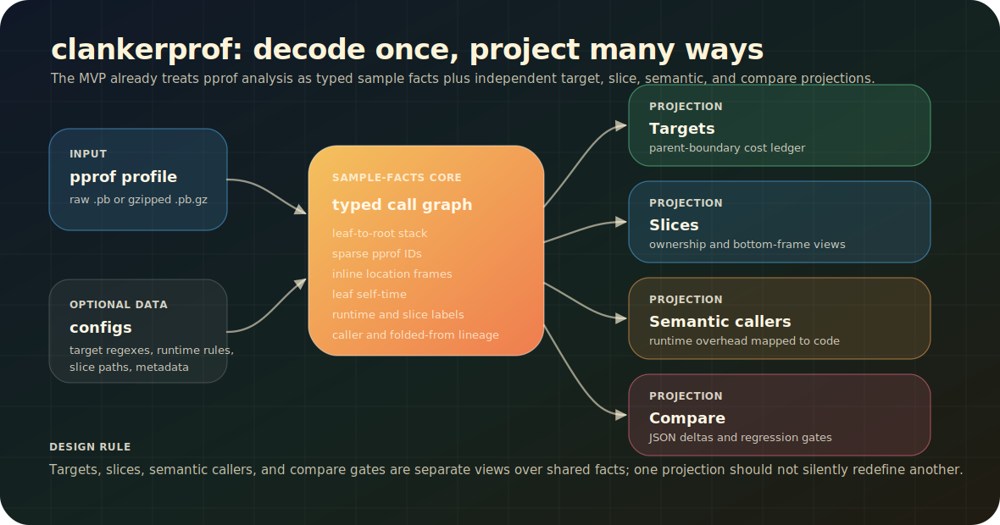

# clankerprof

`clankerprof` turns pprof CPU profiles into a typed call graph and a small set
of durable reports: target-boundary cost ledgers, responsibility slices,
semantic caller exports, and before/after regression gates.

<p align="center">
  
</p>

`clankerprof` is call-graph first: keep the sampled stack intact, then choose
the attribution level that answers the question.

Leaf frames often describe CPU mechanics: `Object#new`, `String#gsub`,
`JSON.parse`, native runtime work, template execution, compression, or I/O
clients. Those are useful clues, but the actionable caller is usually higher in
the stack: `HotelSearch#rank_results`, `CalendarExport#to_json`, or
`MapView#load_tiles`.

The tool keeps those views connected. It can show the low-level CPU mechanics,
then fold or attribute that cost back to the caller, boundary, semantic bucket,
or responsibility slice that made the work happen.

## Start With Defaults

Start with a broad profile read. Add config only when the useful projection is
clear.

```bash
# Broad "what frames own CPU?" view. No slice config required.
clankerprof slices --profile profile.pb.gz

# Explain CPU below one known parent frame. No JSON config required.
clankerprof targets \
  --profile profile.pb.gz \
  --target HotelSearch#rank_results

# Write stable JSON once the query is useful.
clankerprof slices \
  --profile profile.pb.gz \
  --output tmp/profile-slices.json
```

Add config for stable labels, path categories, filters, collapse rules, runtime
semantics, or metadata:

```bash
clankerprof targets --profile profile.pb.gz --config target_config.json
clankerprof slices --profile profile.pb.gz --config clankerprof-slices.yml
```

The same commands are also available through the umbrella CLI:

```bash
autoclanker pprof slices --profile profile.pb.gz
autoclanker pprof targets \
  --profile profile.pb.gz \
  --target HotelSearch#rank_results
```

## How It Thinks

`clankerprof` decodes pprof samples into one sample-facts model, then projects
that model into the view you need: target cost, slice ownership, semantic
callers, or compare gates.

## What It Answers

- Which parent boundary accumulated this CPU?
- Is the cost allocation, string processing, serialization, I/O,
  instrumentation, template execution, or application logic?
- Which responsibility slice carries the cost after filters, collapse rules,
  and attribution rules?
- Did a before/after run regress a focused slice enough to fail a benchmark or
  CI gate?

## Inputs and Outputs

`clankerprof` is intentionally boring at the edges:

| Input | Purpose |
| --- | --- |
| `profile.pb` or `profile.pb.gz` | Required pprof CPU profile. |
| `--target <function>` | Minimal target mode for explaining CPU below a known parent frame. |
| `target_config.json` | Optional richer target categories for path-based attribution. |
| `clankerprof-slices.yml` / `slices.yml` | Optional slice ownership, filters, collapse rules, and metadata. |
| runtime rule pack | Optional semantic labels and runtime-internal folding. |

| Output | Purpose |
| --- | --- |
| target JSON/CSV/text | Parent-boundary cost ledger. |
| slice JSON | Responsibility view with top frames and metadata. |
| semantic callers CSV | Runtime/native leaves such as `Object#new` mapped back to callers. |
| compare JSON + exit code | Before/after regression gate for benchmark or CI use. |

## Architecture

The core model preserves pprof IDs, mappings, inline frames, sample values, and
call paths. Runtime behavior is loaded from rule packs. Domain ownership or
responsibility labels are loaded from slice configs. Neither concept is baked
into the profile decoder.

<p align="center">
  
</p>

## Why This Shape

Profile tooling tends to drift when one report mode owns the whole analysis
strategy. `clankerprof` keeps the pieces separate:

| Layer | Responsibility | Why it matters |
| --- | --- | --- |
| Decode | Parse raw and gzipped pprof payloads without generated protobuf files. | Profiles remain portable across environments and package builds. |
| Sample facts | Represent samples, frames, mappings, and paths with typed objects. | Every projection works from the same accounting surface. |
| Runtime rules | Label native/core frames and fold runtime internals when requested. | Language-specific insight stays data-driven and opt-in. |
| Projections | Render target, slice, semantic-caller, and compare outputs. | Different investigation questions do not redefine the core facts. |
| Artifacts | Emit JSON, CSV, and text output with stable fields and exit codes. | Agents, CI, and review tools can consume evidence without scraping prose. |

## Command Map

```bash
clankerprof targets --profile profile.pb.gz --target HotelSearch#rank_results
clankerprof slices --profile profile.pb.gz --config clankerprof-slices.yml
clankerprof compare --before before-slices.json --after after-slices.json
```

The same commands are exposed through the umbrella CLI:

```bash
autoclanker pprof targets --profile profile.pb.gz --target HotelSearch#rank_results
autoclanker pprof slices --profile profile.pb.gz --config clankerprof-slices.yml
autoclanker pprof compare --before before-slices.json --after after-slices.json
```

## Target Attribution

Use `targets` when the question starts with a known boundary: a request handler,
background job, renderer, RPC method, compiler pass, query executor, or any
other parent frame that represents the work you want to explain.

```bash
clankerprof targets \
  --profile profile.pb.gz \
  --target HotelSearch#rank_results \
  --format json \
  --output tmp/profile-targets.json
```

That reports all cost under the target as `Other`, which is useful for a first
pass because it proves the boundary and total before adding categories.

Add a target config when you want stable category labels:

```json
{
  "HotelSearch#rank_results": {
    "Ranking": "app/ranking/**",
    "Availability": "lib/availability/**",
    "Maps": "lib/maps/**",
    "Cache Client": "gem:cache-client"
  }
}
```

Every sample whose stack contains the configured parent is attributed by the
leaf self-time frame. If no category matches, the time remains accounted for as
`Other`; target totals do not silently disappear.

Prefer path patterns such as `app/ranking/**` or `lib/maps/**` in new target
configs. Use `gem:cache-client` for versioned gem paths. Existing regex
patterns still work, and `regex:...` can make that intent explicit when a
category genuinely needs regex matching.

## Slice Attribution

Use `slices` when the question is responsibility-oriented: which component,
library, subsystem, or code area owns selected CPU after filters and collapse
rules?

```bash
clankerprof slices --profile profile.pb.gz

clankerprof slices \
  --profile profile.pb.gz \
  --config clankerprof-slices.yml \
  --output tmp/profile-slices.json
```

Slice config:

```yaml
slices: ./slices.yml
filters:
  - <name:HotelSearch#rank_results
collapse:
  - gem:telemetry-client
attribute:
  - name:MapTileEngine::Native,to:maps-native
by_slice: 5
top: 10
show_paths: true
```

Slice definitions:

```yaml
slices:
  - name: search-ranking
    paths:
      - app/ranking/**
      - lib/availability/**
    metadata:
      owner: search-platform
      docs:
        - https://example.invalid/search
  - name: default
    default: true
```

Unknown slice keys are preserved as generic metadata in the JSON output, so
callers can attach owners, contacts, docs, escalation hints, or any other
domain-specific labels without changing `clankerprof`.

## Runtime Rules

The core analyzer is not Ruby-specific, Go-specific, Python-specific, or tied
to one ownership system. Runtime behavior is opt-in:

```bash
clankerprof targets \
  --profile ruby-profile.pb.gz \
  --config target_config.json \
  --runtime ruby \
  --fold-runtime-internals \
  --track-semantic-callers \
  --semantic-callers-csv tmp/semantic-callers.csv
```

The packaged Ruby rule pack can label native/core frames and fold
runtime-internal cost into meaningful callers. Additional runtimes should be
added as data files plus tests, not as special cases in the decoder.

## Compare Gates

`compare` consumes two slice JSON reports and fails with exit code `2` when a
slice crosses both absolute and relative thresholds:

```bash
clankerprof compare \
  --before tmp/before-slices.json \
  --after tmp/after-slices.json \
  --threshold-abs 2.0 \
  --threshold-rel 15.0
```

This makes profile evidence usable in CI or benchmark harnesses without
depending on terminal-only summaries.

## Library Map

| Module | Purpose |
| --- | --- |
| `proto.py` | Minimal pprof protobuf decoder. |
| `model.py` | Typed profile, sample, frame, location, function, and mapping models. |
| `analysis.py` | Call graph construction plus target and slice attribution. |
| `rules.py` | Runtime rule packs, slice configs, filters, collapse rules, and attribute rules. |
| `compare.py` | Before/after slice delta checks. |
| `render.py` | JSON, CSV, simple CSV, and text renderers. |
| `cli.py` | `clankerprof` command surface. |

## Design Contract

- Decode once; project many times.
- Keep target accounting and slice attribution separate.
- Preserve raw profile identity while adding semantic labels as projections.
- Keep runtime and ownership knowledge declarative.
- Prefer stable JSON and CSV artifacts over terminal prose.
- Treat compatibility output shapes as explicit modes, not hidden defaults.

## More

- Full guide: `../docs/CLANKERPROF.md`
- Compatibility notes: `../docs/CLANKERPROF_PARITY.md`
- Example configs: `../examples/clankerprof/`
