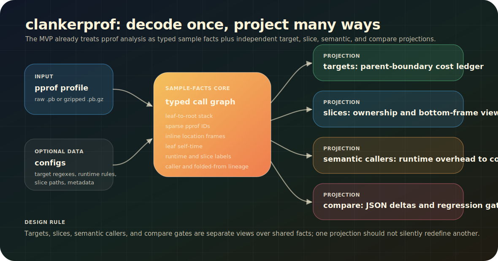

# clankerprof

`clankerprof` is a language-neutral pprof CPU profile analyzer packaged with
`autoclanker`. It turns raw profile samples into a typed call graph and stable
artifacts that can survive handoff into issue seeds, benchmark loops, CI gates,
and code review.

<p align="center">
  
</p>

The core strategy is call-graph first. Leaf frames often describe CPU
mechanics: `Object#new`, `String#gsub`, `JSON.parse`, native runtime work,
template execution, compression, or I/O clients. Those are useful clues, but
the actionable caller is usually higher in the stack: `HotelSearch#rank_results`,
`CalendarExport#to_json`, or `MapView#load_tiles`.

`clankerprof` keeps those views connected. It can show the low-level CPU
mechanics, then fold or attribute that cost back to the caller, boundary,
semantic bucket, or responsibility slice that made the work happen.

The same sample-facts model can be rendered as target-boundary reports,
responsibility slices, semantic caller exports, or before/after regression
gates.

<p align="center">
  
</p>

## Why use it

- Decode raw and gzipped `.pb` profiles without generated protobuf runtime files.
- Preserve pprof IDs and inline frames in a typed call graph model.
- Explain a known parent boundary with complete target-function attribution.
- Opt into runtime rule packs such as Ruby core/native semantic labeling.
- Fold runtime-internal cost into meaningful callers when that answers the
  investigation question.
- Emit CSV and JSON artifacts that agents, CI gates, and review tools can
  consume without scraping terminal prose.
- Keep slice attribution separate from target attribution so ownership views do
  not redefine parent-boundary cost accounting.

## Command surfaces

| Command | Use it for | Primary output |
| --- | --- | --- |
| `clankerprof targets` | Explain CPU under one or more configured parent functions, request handlers, renderers, jobs, or RPC boundaries. | JSON, CSV, simple CSV, or text target reports. |
| `clankerprof slices` | Attribute selected CPU to path-based responsibility slices with filters, collapse rules, and metadata. | JSON slice reports for humans, agents, and compare gates. |
| `clankerprof compare` | Compare two slice JSON outputs with absolute and relative regression thresholds. | JSON delta report plus exit code `2` on regression. |
| `autoclanker pprof ...` | Run the same subcommands through the main `autoclanker` CLI. | Same payloads as `clankerprof`. |

## MVP contract

The current MVP is already useful as a standalone library and CLI. It is not yet
a claim that every historical profile report can be deleted without real-profile
golden verification.

The tested compatibility contract is tracked in
[`CLANKERPROF_PARITY.md`](CLANKERPROF_PARITY.md). Treat that file as the source
of truth for what compatibility is claimed versus intentionally not claimed.

The next phase should deepen the sample-facts engine: make the fact graph more
explicit as a reusable library API, add richer projection composition, and bring
additional runtime rule packs online without making any one runtime or ownership
system part of the core model.

## Quickstart

Use any pprof CPU profile exported as raw `.pb` or gzipped `.pb.gz`.

```bash
clankerprof targets \
  --profile profile.pb.gz \
  --config examples/clankerprof/target_config.json \
  --runtime ruby \
  --fold-runtime-internals \
  --track-semantic-callers \
  --semantic-callers-csv tmp/semantic-callers.csv \
  --format json \
  --output tmp/profile-targets.json

clankerprof slices \
  --profile profile.pb.gz \
  --config examples/clankerprof/clankerprof-slices.yml \
  --output tmp/profile-slices.json
```

See [`../examples/clankerprof`](../examples/clankerprof) for copyable target and
slice configs.

## Target Attribution

Use this mode when you know the parent function or request/rendering boundary
you want to explain.

```bash
clankerprof targets \
  --profile profile.pb.gz \
  --config target_config.json \
  --format csv \
  --output slices.csv
```

`target_config.json` maps parent function names to category path patterns:

```json
{
  "Target#render": {
    "Application": "app/**",
    "Cache Client": "gem:cache-client"
  }
}
```

Every sample whose stack contains `Target#render` is attributed by the leaf
self-time frame. If no configured category matches, time goes to `Other`, so the
target total stays fully accounted for.

Prefer path patterns such as `app/**` or `app/components/**` in new configs.
Use `gem:cache-client` for versioned gem paths. Existing regex strings are
still supported for compatibility, and `regex:...` can make intentional regex
matching explicit.

For request-rendering investigations, use the same shape with the request
boundary as the parent and neutral categories for app code, component rendering,
client libraries, native engines, or data-shape work:

```json
{
  "RequestHandler#render_response": {
    "View Model": "app/view_models/**",
    "Components": "app/components/**",
    "Cache Client": "gem:cache-client"
  }
}
```

This is intentionally framework-neutral: the parent can be an HTTP handler,
RPC method, background job, renderer, or any other stack frame that represents
the boundary you want to cost.

## Ruby Runtime Rules

Ruby support is opt-in and data-driven. Pass the runtime and the core-class CSV
instead of relying on hardcoded application or framework assumptions. If
`--ruby-core-classes` is omitted, `clankerprof` uses the packaged Ruby core
class list:

```bash
clankerprof targets \
  --profile ruby-profile.pb.gz \
  --config target_config.json \
  --runtime ruby \
  --ruby-core-classes ruby_core_classes.csv \
  --fold-ruby-internals \
  --format simple-csv \
  --output ruby-slices.csv
```

The Ruby rules classify common native/core frames such as `String#gsub`,
`Marshal.load`, `JSON.parse`, OpenTelemetry, StatsD, I/O clients, and
serialization/compression helpers. Non-verbose mode rolls these into broad
overhead families; `--verbose-ruby-internals` keeps raw categories and folds the
verbose-only native categories when folding is enabled.

For compatibility with older target-attribution runs, pass `--no-enhanced`.
That disables semantic runtime labels and uses the legacy native/delegated
caller fallback before category matching.

To reproduce the old two-file CSV artifact layout from
`--format csv --output slices.csv`, add:

```bash
clankerprof targets \
  --profile ruby-profile.pb.gz \
  --config target_config.json \
  --runtime ruby \
  --format csv \
  --output slices.csv \
  --legacy-target-csv-layout
```

That writes `output/slices.csv` and `output/verbose/slices.csv`, matching older
two-file target report artifact locations while keeping ordinary `csv` and
`simple-csv` as explicit single-output formats.

## Slice Attribution

Use this mode for slice-based responsibility or code-area views. This mode is
kept separate from target attribution: slice CLI/config semantics such as
duplicate scalar validation apply here, not to `clankerprof targets`.

```bash
clankerprof slices \
  --profile profile.pb.gz \
  --slices slices.yml \
  --filter "<name:Target#render" \
  --collapse "gem:statsd-instrument" \
  --attribute "gem:renderer,to:rendering" \
  --output profile-slices.json
```

Slice definitions use path patterns:

```yaml
slices:
  - name: app
    paths:
      - app/**
    metadata:
      owner: rendering-platform
      docs:
        - https://example.invalid/rendering
    contacts:
      - "#rendering-performance"
  - name: default
    default: true
```

Filters support `name:`, `path:`, `gem:`, and descendant prefix `<`. Collapse
rules skip matching frames when choosing the attribution frame. Attribute rules
override slice assignment, including descendant rules such as
`<name:GraphQL::Execute,to:graphql`.
Unknown slice keys are preserved as generic JSON-compatible `metadata` in
slice output. A nested `metadata:` object is flattened into that same payload,
so callers can attach labels, contacts, docs, escalation hints, or any other
domain metadata without teaching `clankerprof` application-specific concepts.

Common slice options can also live in a YAML config:

```yaml
slices: ./slices.yml
filters:
  - <name:RequestHandler#render_response
collapse:
  - gem:statsd-instrument
  - gem:opentelemetry-sdk
attribute:
  - name:TemplateEngine::Native,to:rendering-native
by_slice: 5
top: 10
show_paths: true
```

Run it with:

```bash
clankerprof slices --profile profile.pb.gz --config clankerprof-slices.yml
```

CLI array flags such as `--filter`, `--collapse`, and `--attribute` append to
config-file arrays. Single-value fields such as `slices`, `top`, and `by_slice`
fail if supplied in both places so analysis inputs do not drift silently.
TOML config files are also accepted, and
`./slices.yml` is discovered automatically when slice-aware options are used.
Attribute targets must name a configured slice by default so typos are caught
early. If you intentionally want an output-only virtual slice, pass
`--allow-virtual-attribute-slices`.

## Compare

Compare two JSON slice outputs in CI or in a review artifact:

```bash
clankerprof compare \
  --before before.json \
  --after after.json \
  --threshold-abs 2.0 \
  --threshold-rel 15.0
```

The command returns JSON with `has_regression`, per-slice deltas, and top
function regressions/improvements. The CLI exits `2` when a regression exceeds
the configured thresholds for gate-friendly automation. `autoclanker pprof ...`
exposes the same subcommands as a convenience alias.

## Library Shape

The public Python modules are small enough to use directly when a CLI subprocess
is not the right integration point:

```python
from clankerprof.analysis import TargetAnalysisOptions, analyze_targets, load_json_mapping
from clankerprof.proto import load_profile
from clankerprof.render import render_target_json

profile = load_profile("profile.pb.gz")
config = load_json_mapping("examples/clankerprof/target_config.json")
results = analyze_targets(profile, config, TargetAnalysisOptions())
payload = render_target_json(results)
```

For advanced integrations, treat `Profile.stack_for_sample(...)` as the current
typed call graph seam. The next phase should make this seam more explicit as a
first-class sample-facts API, but the existing model already preserves the facts
that matter for safe projection: leaf-to-root stack order, sparse IDs, inline
frames, leaf self-time, target containment, slice labels, folded-from lineage,
and semantic callers.

## Integration Guidance

Prefer this order when adopting `clankerprof` in another harness:

1. Produce `targets --format json` for parent-boundary diagnosis.
2. Produce `slices --output profile-slices.json` for ownership or code-area
   triage.
3. Use `compare` only on slice JSON outputs generated from stable configs.
4. Keep runtime-specific behavior in rule packs and config files.
5. Keep old profile tools available until real-profile golden outputs match the
   compatibility contract you need.
