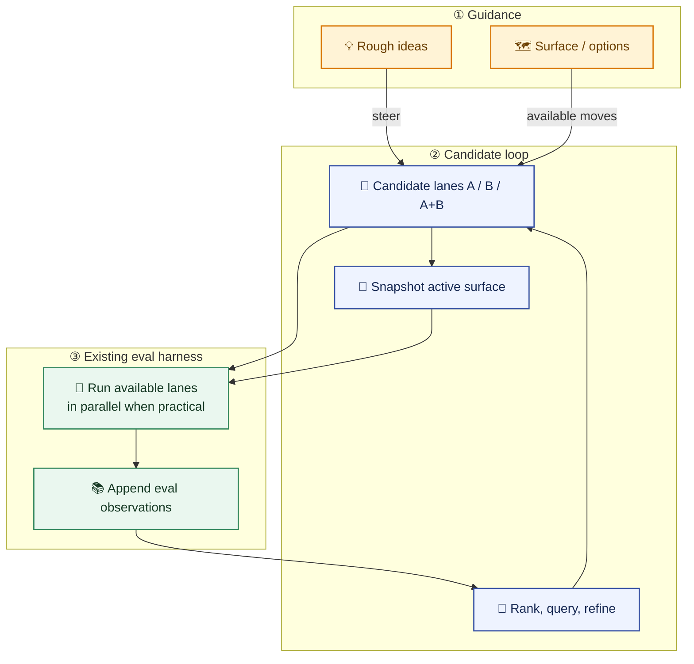

# Loop Diagram

This is the compact loop view of `autoclanker`: ideas steer explicit candidate
lanes, the existing eval harness can run the available lanes in parallel when
practical, and the resulting observations feed the next ranked choice while the
session keeps its active surface snapshotted on disk.

Editable Mermaid source lives at
[`docs/assets/autoclanker_loop.mmd`](./assets/autoclanker_loop.mmd).
